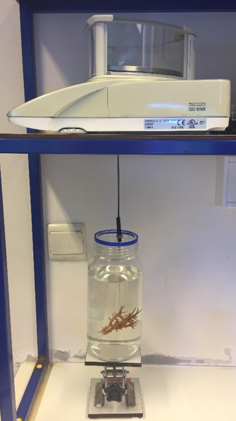

```{r setup, include=FALSE}
knitr::opts_chunk$set(echo = FALSE, warning = FALSE)
SciViews::R
growth <- read("../../data/growth.rds")
```

### Matériels et méthodes

\columnsbegin
\columnsmall
```{r,fig.align='center', echo=FALSE, out.width= '80%'}

```
\columnlarge

La masse squelettique est déterminée via le poids immergé
\columnsend

### Taux de croissance

```{r, fig.align='c', out.width= '85%'}
chart(growth, formula  = g_rate_day ~ number_day %col=% id |cond) +
  geom_point(show.legend = FALSE) +
  geom_line(show.legend = FALSE) +
  geom_vline(xintercept = c(29, 32,36))
```
